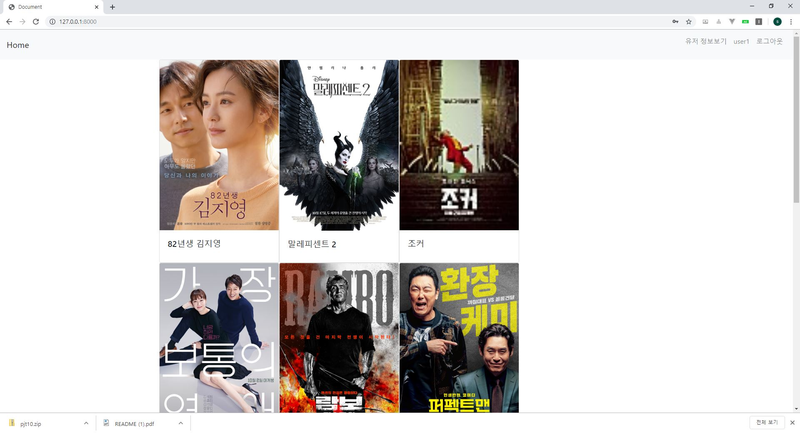
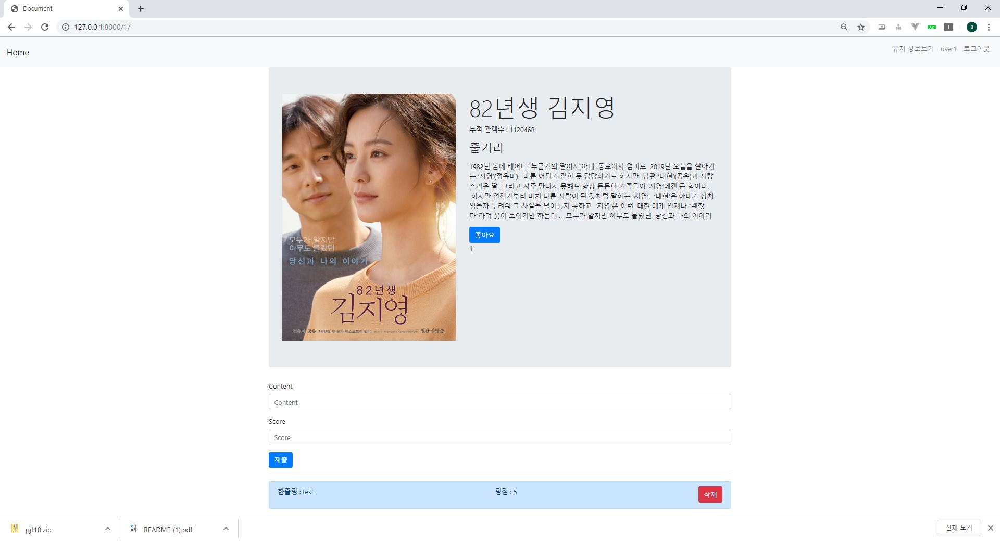
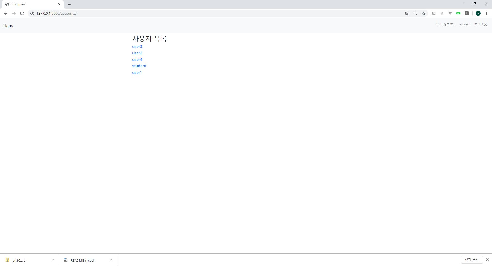
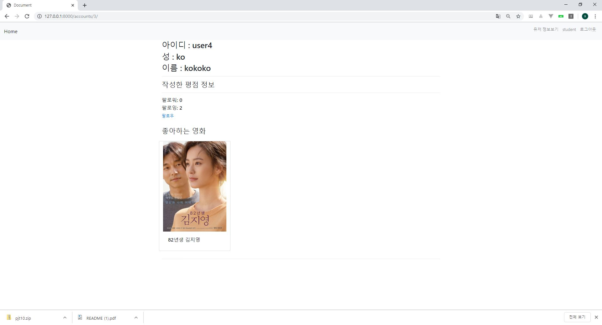

# pjt10 README

##### 어려웠던 것 위주로 기술

#### 1 - 2 유저 상세보기


해당 유저가 작성한 평점 정보 및 좋아하는 영화 정보를 모두 출력하기 위해서 model 설정을 해줄 필요가 있다.

영화 - 유저(다대다 관계)

영화 - 평점(다대일 관계)

**movies/models.py**

```python
from django.db import models
from django.conf import settings

# Create your models here.
class Genre(models.Model):
    name = models.CharField(max_length=20)

class Movie(models.Model):
    title = models.CharField(max_length=30)
    audience = models.IntegerField()
    poster_url = models.CharField(max_length=140)
    description = models.TextField()
    genre = models.ForeignKey(Genre, on_delete=models.CASCADE)
    like_users = models.ManyToManyField(settings.AUTH_USER_MODEL, related_name="like_movies")

class Review(models.Model):
    content = models.CharField(max_length=140)
    score = models.IntegerField()
    movie = models.ForeignKey(Movie, on_delete=models.CASCADE)
    user = models.ForeignKey(settings.AUTH_USER_MODEL, on_delete=models.CASCADE)

```


해당 유저를 팔로우 한 사람의 수, 팔로잉 한 사람의 수가 출력됩니다.

우선 django 내의 user의 항목을 수정하기 위해서 다음과 같이 models.py를 짯다

```python
from django.db import models
from django.contrib.auth.models import AbstractUser
from django.conf import settings
# Create your models here.

class User(AbstractUser):
    followers = models.ManyToManyField(settings.AUTH_USER_MODEL, related_name="followings")
```

User 끼리 follower 와 following 관계 (다대다)를 만들기 위해 User model을 다시 설정해 주었다.


그리고 로그인한 User가 자기 자신을 follow하지 않고 내가 다른 사람의 follower 목록에 있다면 follow 취소를 없다면 follower 목록에 추가하는 방식으로 하였다.

**views.py**

```python
def follow(request, id):
    you = get_object_or_404(User, id=id)
    me = request.user
    if not you==me:
        if me in you.followers.all():
            you.followers.remove(me)
        else:
            you.followers.add(me)
            # me.followings.add(you)

    return redirect('accounts:detail', id)
```

#### 결과물 예시 화면의 스크린샷









#### 협업 하면서 느낀 점

github를 이용하여 역할을 분담해서 작업을 하고싶었는데, 사용법이 익숙지않아서 결국 한대의 컴퓨터로 작업을하였다. github을 이용한 분업화를 좀 더 고민하여 추후에 있을 프로젝트에는 그 기능을 이용하여 역할분담이 좀 더 철저하게 이뤄지는 프로젝트를 진행하고싶다.